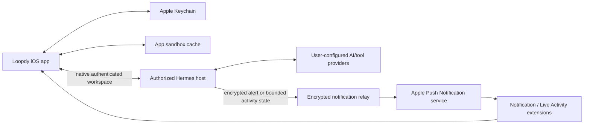

# bighelp for iOS

bighelp (formerly Loopdy) is a SwiftUI client for working with personal AI
agents running through [Hermes](https://github.com/NousResearch/hermes-agent).
Much of the source still uses the Loopdy name internally. It provides chat, multi-agent rooms, voice conversations, approvals,
scheduled work, agent management, rich generated interfaces, notifications, and
Live Activities.

The production app is **native-first**: a configured, independently authenticated
Hermes host supplies the workspace through its public `hermes serve` interfaces.
Use a Tailscale address, HTTPS URL or supported IP address and authenticate to
Hermes; a Loopdy account and relay pairing are not required for that connection.
Networking addresses do not replace host authentication.

**Cloudflare is used only for optional notification and Live Activity delivery.**
Chat setup, authentication, sessions, streaming, tool execution and reconnection
use Hermes directly. Production does not start a Link chat socket, cloud outbox,
or paired Direct listener. A cloud outage cannot select another chat route.

## Security at a glance

- Native host credentials remain in device-only Keychain storage. HTTPS uses
  normal Apple trust; certificate bypass and arbitrary-load exceptions are not used.
- Optional notification enrollment pins the authenticated host and recipient
  before enabling encrypted delivery. It does not enroll a chat transport.
- Link devices sign authenticated cloud requests with their own private keys.
- The app stores account encryption keys and device private keys in the Apple
  Keychain with device-only protection.
- Passkeys use system-provided user verification. Biometric data never enters
  the app or Loopdy infrastructure.
- Link account deletion requires a fresh passkey assertion, revokes notification and
  Live Activity delivery, purges the per-account routing object and account
  directory, and removes cloud-account data. It does not erase independent native
  host authentication or retarget its workspace.
- The authorized source encrypts notification text for the recipient device.
  The notification service extension authenticates it before rendering it.
- Turn-based voice transcribes on the device. Separately authorized live-voice
  paths can stream microphone audio to the configured host/provider.
- No advertising or analytics SDK is included.

See [Security and privacy](docs/SECURITY_AND_PRIVACY.md) for the complete threat
model, data inventory, limitations, and retention description.

## Main capabilities

- Direct and streaming chat with an authorized Hermes agent
- Ordinary native file uploads; native prompt images remain unavailable
- Rich message cards and generated forms
- Tool, reasoning, and delegated-work activity timelines
- Capability-gated session model and reasoning controls
- Slash-command discovery
- Session history, hydration, search and filtering; checkpoint forking where supported
- Pinned-first sessions with newest-created-first ordering, plus collapsible,
  reorderable project sections shared by Sessions and the Quick Workspace sidebar
- Multi-agent Bot Mode with explicit `@mention` routing
- Agent creation, editing, avatars, and runtime defaults
- Scheduled task creation and management
- Approvals and inbox workflows
- Voice conversations with on-device speech recognition and remote speech output
- Encrypted push notifications
- Live Activities and Dynamic Island progress
- Passkey accounts, device pairing, rename, unpair, and push-health management
- Light/dark appearance, themes, Dynamic Type, VoiceOver labels, Reduce Motion
  behavior, and configurable workspace gestures

Native images are explicitly unavailable until official Hermes can bind an
upload to the intended message; they are not sent through the shared pending-image
queue or disguised as ordinary files. Native selected-checkpoint forking,
whole-conversation deletion and current-session reasoning writes also remain
unavailable where their required public contracts are missing. An API-supported
feature is not proof that a particular request was authorized or completed.

## Project facts

- Swift 6 language mode
- SwiftUI and Observation, with UIKit-owned chat recycling and native text editing
- iOS 17 minimum deployment target
- Passkey account creation/sign-in requires iOS 18 because it uses the passkey
  PRF extension
- XcodeGen project generation
- App, notification service extension, and Live Activity extension targets
- One vendored MIT runtime package: ThinkingOrbsKit, pinned with provenance
  under `Packages/ThinkingOrbsKit`
- More than 36,000 lines of product Swift and 13,000 lines of tests
- Unit tests use Swift Testing; UI coverage uses XCUITest

## Architecture



Cloudflare can observe routing metadata such as connection timing, approximate
message sizes, and device coordinates. Under the documented key-establishment
assumptions, the deployed routing path cannot decrypt Loopdy Link message
frames. The authorized Hermes host necessarily receives plaintext to perform
the user's requested work, and any provider configured by that host may receive
content according to that provider's terms.

## Loopdy Cards

Loopdy Cards are validated `loopdy.card` version 1 documents that an agent can
compose from a finite native component catalog. Cards are data, not downloaded
Swift, JavaScript, HTML, WebViews, or executable code. Version 1 is display-only;
existing generated forms continue to handle user input and request-bound
submissions.

Build 3 ships static Cards only. Every displayed value is embedded in the card,
`data_sources` must be empty, and both the Hermes plugin and iOS app reject live
Card sources. Opening a Card makes no third-party Card data request. Live Card
refresh remains reserved for a later security-reviewed release.

See [Loopdy Cards](docs/LOOPDY_CARDS.md) for the complete wire example, finite
component table, static delivery flow, trust boundaries, template lifecycle, and
legacy compatibility statement.

Loopdy Cards credits Sameer Gupta's
[Generative UI DSL](https://github.com/sameergdogg/generative-ui) for the
constrained JSON-tree and fixed native component-catalog approach.
[Google A2UI](https://github.com/google/A2UI) and
[`json-render`](https://json-render.dev/) are related designs only. Loopdy does
not claim adoption, endorsement, API compatibility, or copied code from any of
these projects.

## Repository layout

| Path | Purpose |
|---|---|
| `Loopdy/App` | Composition root, navigation, shell, route-model lifetime |
| `Loopdy/DirectHermes` | Selected native authentication, RPC/HTTP transport, streaming and workspace adapters |
| `Loopdy/Hermes` | Selected native session catalog/history models alongside older HTTPS compatibility clients; the legacy `HermesClient` path is not selected |
| `Loopdy/Link` | Passkeys, devices, pairing, encrypted transport, push setup |
| `Loopdy/Chat` | Timeline, composer, attachments, generated UI, commands |
| `Loopdy/Cards` | Loopdy Card validation, static runtime, native renderer, templates |
| `Loopdy/BotMode` | Multi-agent rooms, mentions, run coordination |
| `Loopdy/Agents` | Agent directory, editor, runtime defaults |
| `Loopdy/Sessions` | Local cache, remote catalog, hydration, forking |
| `Loopdy/Scheduling` | Scheduled task models, editor, validation |
| `Loopdy/Voice` | Recognition, turn state, playback, audio-session ownership |
| `Loopdy/LiveActivity` | ActivityKit lifecycle and privacy-bounded projection |
| `Loopdy/NotificationShared` | Notification trust and decryption shared code |
| `Loopdy/Persistence` | Versioned crash-safe JSON repositories |
| `LoopdyNotificationService` | Fail-closed notification decryption |
| `LoopdyLiveActivity` | Lock Screen and Dynamic Island presentation |
| `LoopdyActivityShared` | Shared ActivityKit attributes and validation |
| `LoopdyTests` / `LoopdyUITests` | Unit, integration, crypto, and UI tests |

## Documentation

- [Architecture and end-to-end flows](docs/ARCHITECTURE.md)
- [Product purpose and experience vision](PRODUCT.md)
- [Chat interaction contract and regression coverage](docs/CHAT_INTERACTION_CONTRACT.md)
- [Chat performance baseline and evidence limits](docs/CHAT_PERFORMANCE_VALIDATION.md)
- [Loopdy Cards protocol and static delivery](docs/LOOPDY_CARDS.md)
- [Cloudflare infrastructure](docs/CLOUDFLARE_INFRASTRUCTURE.md)
- [Security and privacy](docs/SECURITY_AND_PRIVACY.md)
- [Development and testing](docs/DEVELOPMENT.md)
- [iPhone tools for Hermes: Health, Calendar and Reminders](docs/IPHONE_DEVICE_TOOLS.md)
- [Contributing](CONTRIBUTING.md)
- [Reporting a vulnerability](SECURITY.md)

## Install the Hermes plugin

Core native workspace access uses stock Hermes. Optional plugin-backed features
use the tracked `plugins/loopdy` package in the active Hermes profile. Install
and enable it through Hermes' normal plugin workflow:

```sh
hermes plugins install promptclickrun/loopdy-ios/plugins/loopdy --enable
```

Activate the updated plugin using the documented restart workflow for the
Hermes process you operate. Native connections do not require Link pairing.
For the optional Link path, `hermes loopdy link pair` prints the details used by
**Settings → Loopdy Link → Pair a Device** in the iOS app. See the
[plugin guide](plugins/loopdy/README.md) for local-checkout installation,
diagnostics, notification delivery, and platform support.

## Quick start

Requirements:

1. A macOS development environment with a current Xcode that supports Swift 6
2. XcodeGen 2.43 or newer
3. An iOS 17+ simulator or device

Set your signing team, then generate the project:

```sh
cp Config/Local.xcconfig.example Config/Local.xcconfig   # add your Team ID
xcodegen generate
```

`Config/Local.xcconfig` is git-ignored. It holds your Apple Team ID and, if you
use push notifications, a BuzzKit client key. Simulator builds work with it left
empty. Use bundle,
associated-domain, and Keychain-group identifiers they control. For simulator
work that does not exercise production Apple services, select the `Loopdy`
scheme and run in fixture mode.

For isolated development without a production service, launch with:

```text
-use-demo-fixtures
-disable-demo-delays
```

Native use does not require an available Link service or cloud account. This
source still validates a bundled HTTPS `LoopdyLinkBaseURL` while constructing
optional cloud-service objects; omitting that build configuration is not yet
supported. Apple signing and Keychain-group configuration remain required;
push and associated-domain configuration apply to enabled Apple/cloud features.
Credentials and private keys must never be placed in source control.

See [Development](docs/DEVELOPMENT.md) for build and test commands.

## Transparency notes

- This repository contains the iOS client and its extensions.
- Read-only inspection of service metadata and code verified the deployed
  Cloudflare behavior documented here. This repository also contains Link and
  notification relay service sources and recovery/deployment artifacts under
  `services/`. Their presence does not establish that every checked-in revision
  matches the live deployment or independently verifies production configuration.
- This documentation intentionally omits non-public production identifiers,
  private routes, database schemas, operational thresholds, and other details
  that would lower the cost of attacking the deployed service. The client
  necessarily contains its public service origin and public app identifiers.
- This project makes no claim of an independent security audit.

## License

Licensed under the [Apache License, Version 2.0](LICENSE). Bundled third-party
components keep their own licenses: BuzzKit (`Vendor/BuzzKit`, MIT),
ThinkingOrbsKit (`Packages/ThinkingOrbsKit`, MIT), Noto Sans
(`Loopdy/Resources/Fonts`, SIL OFL 1.1) and WebRTC
(`Loopdy/Resources/WebRTC-LICENSE.txt`). Provider logos are trademarks of their
owners and are used only to identify those providers; see
`Loopdy/Resources/ProviderLogos-PROVENANCE.md`.

### Runtime paths and Bot Mode

Hermes owns execution and authoritative runtime state. Loopdy's native workspace
is a client composition, not a second agent engine. Hermes Bot Mode uses
official hosted-room operations through the selected native or Link transport,
with a compatible host plugin and verified running driver. See the
[Bot Mode contract](docs/HERMES_BOT_MODE.md) for execution, approvals, recovery
and the coordinated app/plugin release boundary.
